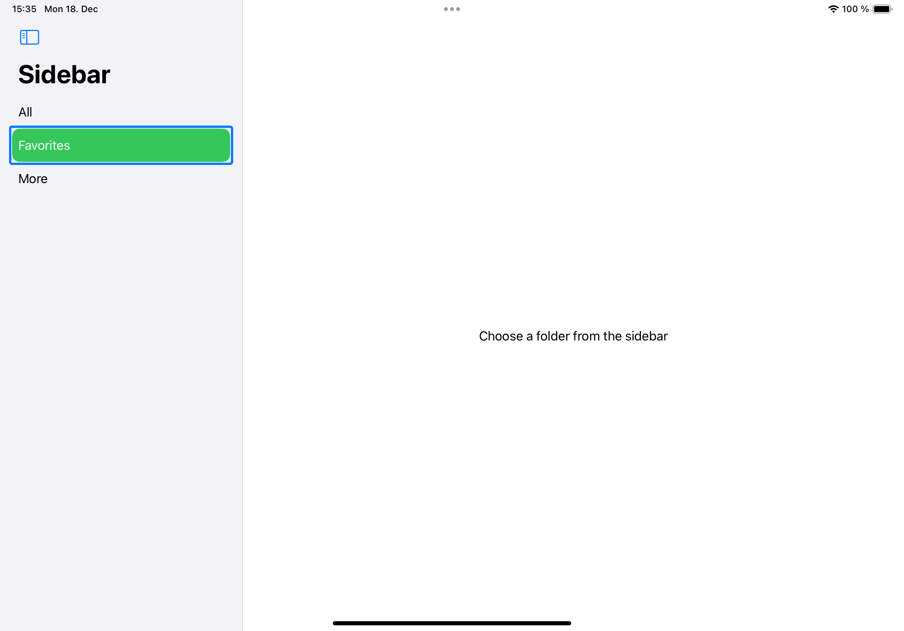

#  FB13475990 - SwiftUI: NavigationsSplitViews Sidebar shows highlight border when ListRowBackground is used.

## Scenario

A SwiftUI app uses a NavigationsSplitView with a Sidebar and a Detail view.
A custom ListRowBackground is applied on the selected list row.

## Issue

In some cases the selected row gets a highlight border.

E.g. when:

	1. The row is tapped on twice.
	2. The sidebar is hidden and appears again.
	3. The app closes into background and reappears.
	4. ...
	
	

	
## Example code

The example shows the described scenario. 

To reproduce the issue: Run on iPad, hide and show the sidebar.

## Tested on

	- iOS 17.2
	- iOS 18.0 beta 1 (22A5282m)

